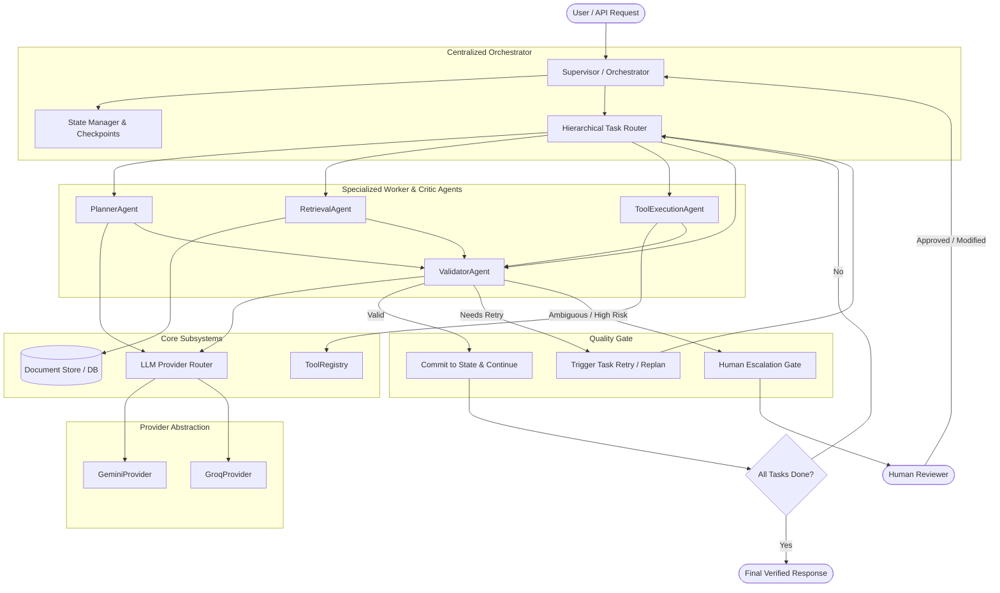
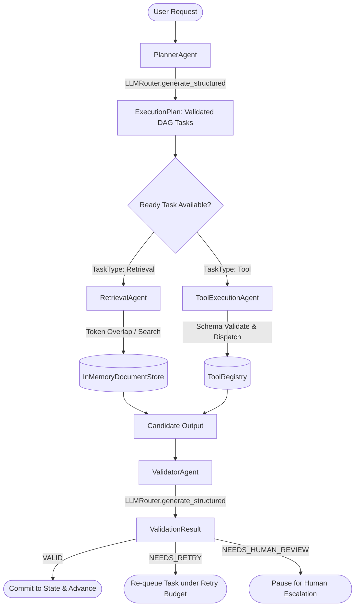
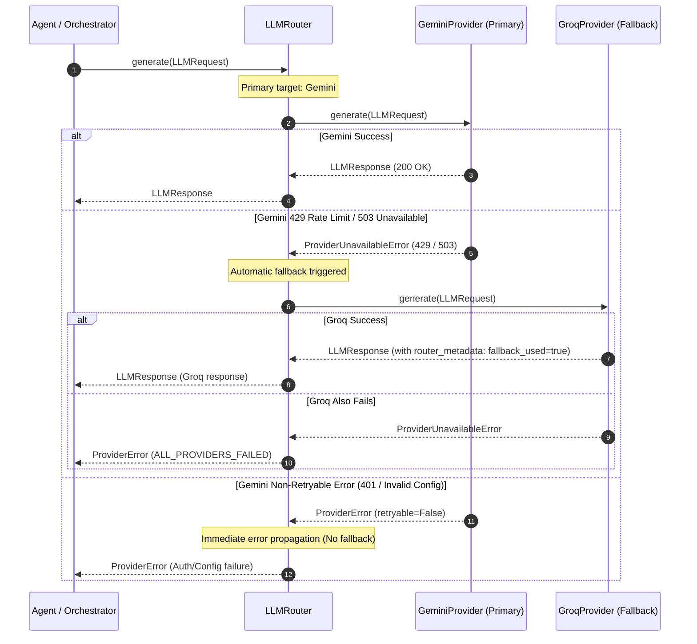
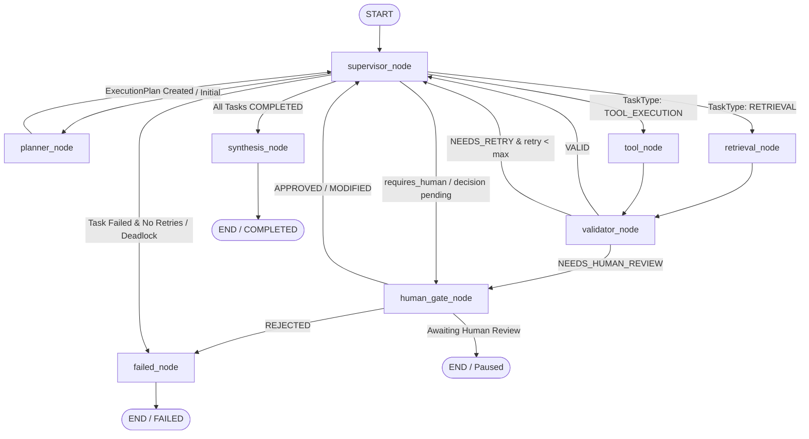
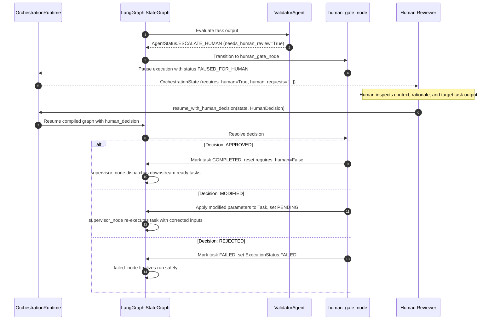
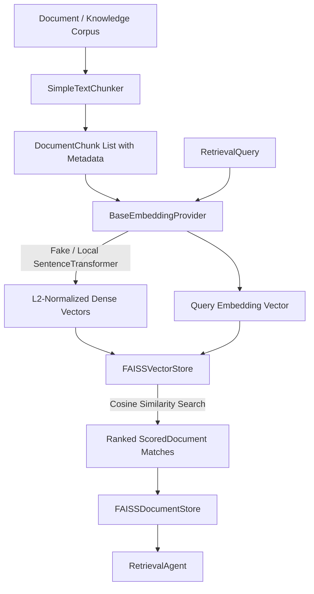
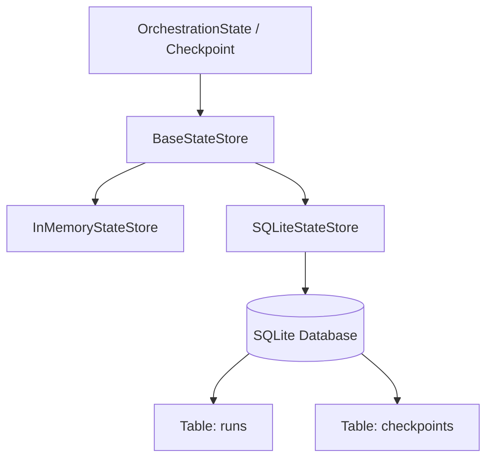
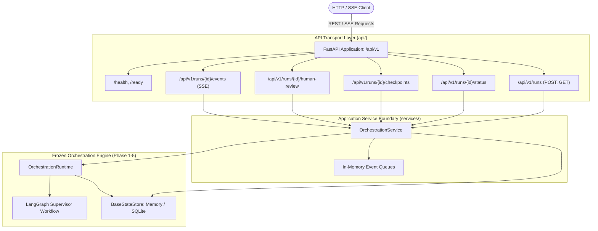
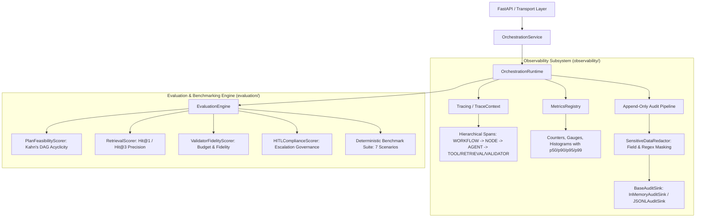

# Enterprise Multi-Agent Orchestration Framework: Architecture & System Design

## 1. Executive Summary & System Goals

The **Enterprise Multi-Agent Orchestration Framework** is a modular, production-grade Python platform designed to solve the challenges of coordinating specialized AI agents in high-reliability enterprise environments.

### Core Goals
1. **Centralized Orchestration & Hierarchical Routing**: Maintain strict control over execution order, task allocation, state transitions, retries, and termination via a centralized supervisor rather than an unpredictable decentralized message bus.
2. **Deterministic State Flow**: Pass immutable, strongly-typed Pydantic state records through the graph with full auditability and snapshot checkpointing.
3. **Provider-Agnostic Model Layer**: Abstract LLM interactions behind a resilient provider contract with automated fallback (e.g. Gemini ➔ Groq) and structured output validation.
4. **Sandboxed & Typed Tool Registry**: Enforce runtime schema validation, security permissions, and timeout budgets on all external tool invocations.
5. **Continuous Verification & Guardrails**: Embed an independent Validator/Critic layer into the lifecycle to critique and verify agent outputs before state commitment.
6. **First-Class Human-in-the-Loop (HITL)**: Provide structured escalation contracts allowing workflows to pause safely for human approval or parameter refinement.

---

## 2. Architectural Principles

* **Separation of Concerns**: Supervisor plans and routes; Worker agents execute specialized tasks; Validator agents judge correctness; Providers handle generation; Stores handle persistence.
* **Schema Enforcement**: All inputs, outputs, state objects, and tool parameters must conform to Pydantic v2 data models.
* **Fail-Safe & Self-Healing**: Differentiate transient retryable errors from permanent non-retryable failures; support automated retry budgets with exponential backoff and provider fallback.
* **Zero Credential Leakage**: Error models, logs, and telemetry representations strictly redact API keys and sensitive parameters.
* **Testability Without Live APIs**: Every interface is mockable/fakeable with zero required live network requests during unit testing.

---

## 3. High-Level System Architecture



---

## 4. Specialized Worker & Critic Agents (Phase 3)

The framework defines four core specialized agents adhering to the `BaseAgent` contract:



### Agent Breakdown

| Agent | Core Responsibility | Primary Collaborator | Key Output |
| :--- | :--- | :--- | :--- |
| **`PlannerAgent`** | Decomposes complex user requests into a dependency-linked Directed Acyclic Graph (`ExecutionPlan`). Validates topological sorting (Kahn's algorithm) to guarantee zero cycles, duplicate IDs, or missing dependencies. | `LLMRouter` | `ExecutionPlan` with validated `Task` items |
| **`RetrievalAgent`** | Ingests, filters, and ranks contextual documents from document stores. Returns ranked `ScoredDocument` items with metadata preservation. | `BaseDocumentStore` (`InMemoryDocumentStore`) | `RetrievalResult` (ranked matches + scores) |
| **`ToolExecutionAgent`** | Dispatches tool calls to the sandboxed `ToolRegistry`. Performs input schema validation, enforces timeout budgets, and captures structured results or execution errors. | `ToolRegistry` | Tool output dict / `AgentResult` |
| **`ValidatorAgent`** | Acts as an impartial quality gate. Evaluates candidate outputs against task objectives and acceptance criteria using structured critique prompts. Emits verdicts: `VALID`, `NEEDS_RETRY`, or `NEEDS_HUMAN_REVIEW`. | `LLMRouter` | `ValidationResult` (is_valid, score, feedback, issues) |

---

## 5. State Lifecycle & Data Flow

```
[1. Request Ingestion]
       │
       ▼  OrchestrationState.create_initial(request)
[2. Plan Generation]
       │
       ▼  Supervisor dispatches to PlannerAgent -> generates ExecutionPlan (Tasks with DAG dependencies)
[3. Task Selection & Routing]
       │
       ▼  Plan.get_ready_tasks() -> selects task with satisfied dependencies
[4. Agent Execution]
       │
       ▼  Agent.execute(state, task) -> returns AgentResult (SUCCESS / RETRYABLE_FAILURE / ESCALATE)
[5. Verification Gate]
       │
       ▼  ValidatorAgent.execute(state, task) -> returns ValidationResult
       ├── VALID ───────────────> State.add_agent_output() & Task.mark_completed()
       ├── NEEDS_RETRY ─────────> Task.retry_count++ (if under budget) -> Re-queue
       └── NEEDS_HUMAN_REVIEW ──> State.request_human_escalation() -> PAUSED_FOR_HUMAN
[6. Step Checkpointing]
       │
       ▼  StateStore.save_checkpoint() & StateStore.save_state()
[7. Completion Evaluation]
       │
       ├── Tasks Remaining ───> Loop back to Step 3
       └── All Completed ─────> Synthesize Final Response -> mark COMPLETED
```

---

## 6. Provider Abstraction & Router Fallback

The framework establishes an isolated model layer decoupling business agents from concrete cloud SDKs.



---

## 7. Tool Registry & Sandboxing

* **Metadata & Discovery**: Tools expose declarative `ToolMetadata` including version, permissions, tags, and timeout budgets.
* **Schema Validation**: Inputs are validated against `tool.input_schema` before execution is invoked.
* **Execution Safety**: Execution is wrapped with `asyncio.wait_for` enforcing timeout limits, and unexpected exceptions are mapped to classified `ToolExecutionError` instances.

---

## 8. Error Taxonomy & Resilience Philosophy

```
OrchestratorError (Base)
├── ValidationError (Input/output/schema violations - Retryable)
├── ConfigurationError (Missing environment variables or settings - Non-Retryable)
├── ProviderError (LLM generation failures)
│   └── ProviderUnavailableError (Rate-limits, 503s, connectivity - Retryable)
├── ToolError (Tool-related failures)
│   ├── ToolNotFoundError (Missing tool in registry - Non-Retryable)
│   └── ToolExecutionError (Runtime execution errors - Retryable)
├── RetrievalError (Vector search / chunking failures - Retryable)
├── OrchestrationError (Graph routing / state anomalies)
│   └── TaskDependencyError (Invalid DAG dependency scheduling - Non-Retryable)
├── TimeoutError (Exceeded execution deadline - Retryable)
└── HumanInterventionRequired (Pause execution for human - Non-Retryable)
```

---

## 9. LangGraph Supervisor Orchestration Runtime (Phase 4)

Phase 4 establishes the centralized, executable execution runtime using LangGraph `StateGraph`.

### 9.1 Graph Architecture & Topology



### 9.2 Validation & Retry Loop

```mermaid
flowchart TD
    Exec[Execute Task: Retrieval or Tool] --> Critic[Validator Critic Evaluation]
    Critic --> Decision{Critic Verdict}

    Decision -->|VALID (is_valid=true)| MarkSuccess[Mark Task COMPLETED]
    MarkSuccess --> ReturnSup[Return to Supervisor]

    Decision -->|NEEDS_RETRY| CheckBudget{retry_count < max_retries?}
    CheckBudget -->|YES| Increment[Increment retry_count & Set PENDING]
    Increment --> ReturnSup

    CheckBudget -->|NO (Exhausted)| MarkFail[Mark Task FAILED & Record Error]
    MarkFail --> ReturnSup

    Decision -->|NEEDS_HUMAN_REVIEW| Escalate[Create HumanEscalationRequest]
    Escalate --> Gate[Route to human_gate_node]
```

### 9.3 Human-in-the-Loop Escalation & Decision Gate



### 9.4 State Ownership: Application State vs. Graph Execution State

To maintain clean separation between business logic and execution infrastructure:
* **Canonical Application State (`OrchestrationState`)**:
  * Pydantic v2 domain model containing execution plan, DAG tasks, step telemetry, tool results, retrieved context, human escalation requests, and run metadata.
  * Serializable, auditable, and persisted to `BaseStateStore` / checkpoints.
* **Graph Execution State (`GraphState`)**:
  * Ephemeral LangGraph `TypedDict` containing `state: OrchestrationState`, `current_task_id: Optional[str]`, `human_decision: Optional[HumanDecision]`, `next_action: Optional[str]`, and `error: Optional[str]`.
  * Used exclusively by LangGraph for internal edge dispatching and node communication.

### 9.5 Loop Prevention & Guardrails

1. **Strict DAG Task Transitions**: Tasks transition monotonically (`PENDING` ➔ `IN_PROGRESS` ➔ `COMPLETED` / `FAILED`). Completed tasks are never re-dispatched.
2. **Authoritative Retry Budget**: Every task defines `max_retries` (default: 3). If `retry_count >= max_retries`, task is permanently failed.
3. **Graph Recursion Limit**: `OrchestrationRuntime` enforces a maximum step limit (default: 50 steps) via LangGraph `recursion_limit` config.
4. **Dependency Deadlock Detection**: If tasks remain pending but no task is ready (e.g. invalid cyclic references or missing dependencies), the supervisor detects the deadlock and routes to `failed_node` instead of looping indefinitely.

---

## 10. RAG & Persistent Retrieval (Phase 5)

Phase 5 introduces pluggable semantic retrieval and persistent application state while preserving existing contracts.

### 10.1 Track A: Semantic RAG & Vector Indexing Architecture



#### Key Components:
1. **`BaseEmbeddingProvider`**: Interface defining `embed_text` and `embed_documents`.
   - `FakeEmbeddingProvider`: Deterministic hash-based pseudo-embeddings for fast, 100% offline unit testing.
   - `LocalSentenceTransformerEmbeddingProvider`: Local HuggingFace/SentenceTransformers embeddings with lazy loading.
2. **`SimpleTextChunker`**: Deterministic chunker splitting documents into overlapping segments with provenance preservation (`source_doc_id`, `chunk_index`, `start_char`, `end_char`).
3. **`FAISSVectorStore`**: Dense vector index using `IndexFlatIP` on L2-normalized float32 vectors, returning exact cosine similarities normalized to `[0.0, 1.0]`. Supports disk persistence (`index.faiss` + `metadata.json`).
4. **`FAISSDocumentStore`**: Implements `BaseDocumentStore`, orchestrating chunking, embedding, and vector storage to serve as a drop-in replacement for `InMemoryDocumentStore`.

---

### 10.2 Track B: Persistent Application State & Checkpoints



#### Relational Database Schema:
```sql
CREATE TABLE IF NOT EXISTS runs (
    run_id TEXT PRIMARY KEY,
    status TEXT NOT NULL,
    created_at TEXT NOT NULL,
    updated_at TEXT NOT NULL,
    state_json TEXT NOT NULL
);

CREATE TABLE IF NOT EXISTS checkpoints (
    checkpoint_id TEXT PRIMARY KEY,
    run_id TEXT NOT NULL,
    step INTEGER NOT NULL,
    created_at TEXT NOT NULL,
    checkpoint_json TEXT NOT NULL,
    FOREIGN KEY (run_id) REFERENCES runs(run_id) ON DELETE CASCADE
);

CREATE INDEX IF NOT EXISTS idx_checkpoints_run_id_step ON checkpoints(run_id, step);
```

#### Serialization & Transaction Safety:
* **Explicit Pydantic JSON**: State is serialized via `model_dump_json()` and parsed via `model_validate_json()` with zero unsafe Python pickling.
* **ACID Transactions**: SQLite connection context managers enforce atomic transactions, rolling back on error and enabling `PRAGMA foreign_keys = ON`.
* **State Parity**: Full recovery and nested roundtrips for `ExecutionPlan`, `Task`s, `ExecutionMetadata`, `retrieved_context`, `tool_results`, and `human_requests`.

---

## 11. FastAPI Service / API Layer (Phase 6)

Phase 6 introduces a high-performance REST and Server-Sent Events (SSE) transport boundary around the frozen orchestration framework.

### 11.1 Service Boundary Architecture



### 11.2 Endpoint Summary

| Method | Path | Description | Response Schema |
| :--- | :--- | :--- | :--- |
| `GET` | `/health` | Liveness health check | `HealthResponse` |
| `GET` | `/ready` | Subsystem configuration readiness probe | `ReadinessResponse` |
| `POST` | `/api/v1/runs` | Initiate and execute multi-agent workflow | `RunResponse` (HTTP 201) |
| `GET` | `/api/v1/runs/{run_id}` | Retrieve full run state | `RunResponse` |
| `GET` | `/api/v1/runs/{run_id}/status` | Retrieve lightweight operational status | `RunStatusResponse` |
| `GET` | `/api/v1/runs/{run_id}/checkpoints` | Retrieve chronological step snapshots | `CheckpointListResponse` |
| `GET` | `/api/v1/runs/{run_id}/human-review` | Inspect active pending human escalation | `HumanReviewResponse` |
| `POST` | `/api/v1/runs/{run_id}/human-review` | Submit human decision (`APPROVED`/`REJECTED`/`MODIFIED`) | `HumanDecisionResponse` |
| `GET` | `/api/v1/runs/{run_id}/events` | Live execution progress via Server-Sent Events | `text/event-stream` |

---

## 13. Observability, Auditability & Evaluation (Phase 7)

Phase 7 introduces the enterprise observability, compliance audit logging, operational metrics, and deterministic evaluation framework.



### 13.1 Auditability & Pre-Sink Sensitive Data Redaction
* **Append-Only Event Ledger**: `AuditEvent` captures timestamp, `schema_version` ("1.0.0"), `run_id`, `correlation_id`, `actor`, `component`, `action`, `outcome`, and immutable `metadata`.
* **Pre-Sink Redaction**: `SensitiveDataRedactor` performs recursive sanitization of payloads before emitting to sinks:
  * Key/field-name matching (`api_key`, `token`, `secret`, `password`, `authorization`, etc.).
  * Regex pattern matching for email addresses, credit card formats, social security numbers, and bearer token strings.
* **Audit Sinks**: Pluggable `BaseAuditSink` implementations including thread-safe `InMemoryAuditSink` and durable append-only `JSONLAuditSink`.

### 13.2 Distributed Tracing & Correlation Context Propagation
* **Hierarchical Span Model**: Vendor-neutral span hierarchy tracking lifecycle duration, parent-child span linking, status codes (`OK`, `ERROR`), and structured span attributes without third-party vendor lock-in.
* **Span Hierarchy**: `WORKFLOW` ➔ `NODE` ➔ `AGENT` ➔ `TOOL` / `RETRIEVAL` / `VALIDATOR` / `HUMAN_GATE`.
* **Trace Context Propagation**: `TraceContext` carries `run_id`, `correlation_id`, and `session_id` throughout async graph execution chains.

### 13.3 Real-Time Metrics & Operational Telemetry
* **Core Primitives**: Thread-safe `Counter`, `Gauge`, and `Histogram` with exact percentile computation (`p50`, `p90`, `p95`, `p99`).
* **Framework Metrics**:
  * `runs_started_total`, `runs_completed_total`, `runs_failed_total` (Counters).
  * `active_runs`, `pending_human_reviews` (Gauges).
  * `run_duration_seconds`, `step_count`, `llm_latency_seconds`, `tool_duration_seconds` (Histograms).
* **API Endpoints**:
  * `GET /api/v1/metrics`: Global operational metrics snapshot.
  * `GET /api/v1/runs/{run_id}/metrics`: Per-run specific metrics and step durations.

### 13.4 Offline Evaluation & Benchmark Suite
* **Deterministic Scorers**:
  * `PlanFeasibilityScorer`: Validates DAG acyclicity using Kahn's topological sort and dependency completeness.
  * `RetrievalScorer`: Measures Hit@1 and Hit@3 recall against golden documents.
  * `ValidatorFidelityScorer`: Verifies critic retry budget bounds and failure accounting.
  * `HITLComplianceScorer`: Asserts strict execution lifecycle adherence during human approval, rejection, and modification.
* **Evaluation Engine**: `EvaluationEngine` aggregates scorer metrics into strongly-typed `EvaluationResult` objects.
* **Golden Scenario Suite**: 7 deterministic test scenarios covering happy paths, DAG dependencies, validator retry loops, HITL approval, HITL rejection, modified parameters re-execution, and sandboxed tool failures.

---

## 14. Roadmap & Implementation Phases

- [x] **Phase 1 — Contracts & Foundation** (State models, task DAG schemas, tool interfaces, error taxonomy)
- [x] **Phase 2 — LLM Providers & Router** (Gemini + Groq providers, fallback router, structured output validation)
- [x] **Phase 3 — Specialized Worker & Critic Agents** (PlannerAgent, RetrievalAgent, ToolExecutionAgent, ValidatorAgent)
- [x] **Phase 4 — LangGraph Orchestration Runtime** (Centralized StateGraph, supervisor routing, validation/retry loop, HITL gate)
- [x] **Phase 5 — RAG & Persistent Retrieval** (Local embeddings, chunking, FAISS vector store, SQLite state & checkpoint store)
- [x] **Phase 6 — API / Service Layer** (FastAPI backend, REST endpoints, SSE streaming, HITL review API)
- [x] **Phase 7 — Observability, Auditability & Evaluation** (Audit sinks, redaction, hierarchical tracing, metrics registry, evaluation engine & benchmarks)


